# A Time Series Analysis of General Motors Company Monthly Sales in the US Market
## by Sara Mezuri

# Introduction 

The American automotive industry is known to be one of the largest and most competitive markets globally, where General Motors Company is among the leading players who have been competing against each other for decades. This project aims to perform a time series analysis of the General Motors Company monthly sales in the US market, for the past 2 decades which will provide insights into their market position, allowing us to uncover patterns, trends, and fluctuations within sequential data, enabling a deeper understanding of temporal relationships. It allows us to make predictions based on historical patterns, facilitating informed decision-making and strategic planning. This analytical approach is particularly valuable in forecasting future trends, identifying anomalies, and extracting meaningful insights from time-ordered datasets.

## Objectives

The main objectives of this project are: 

1. To analyze the sales performance of General Motors in the US market over the last two decades.

2. To identify trends, patterns and seasonality in the sales data of the company.

3. To recognize any of the factors that may have contributed to the increase or decrease in sales performance.

4. To fit a model on the dataset and make predictions for forthcoming data.


## Data Collection and Processing

The data used for this project is the monthly sales data for the General Motors Company in the US market. 

[General Motors Sales Data](https://www.goodcarbadcar.net/ford-motor-company-us-sales-figures/) (click here for the data)

To evaluate our model's predictions and compare them with actual values, we temporarily exclude the most recent 24 months. Subsequently, we will add them later on. 

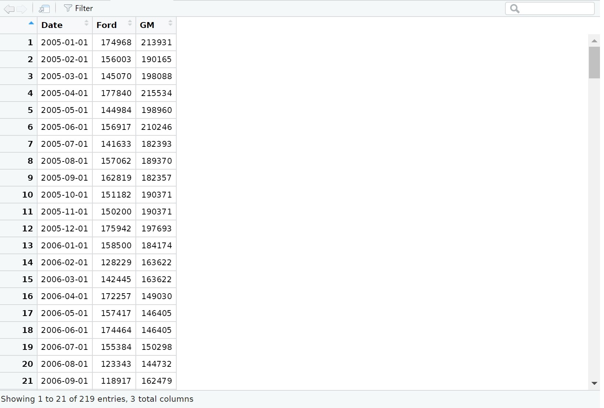

# Exploratory Data Analysis

## Trend, Seasonality and Stationarity Analysis

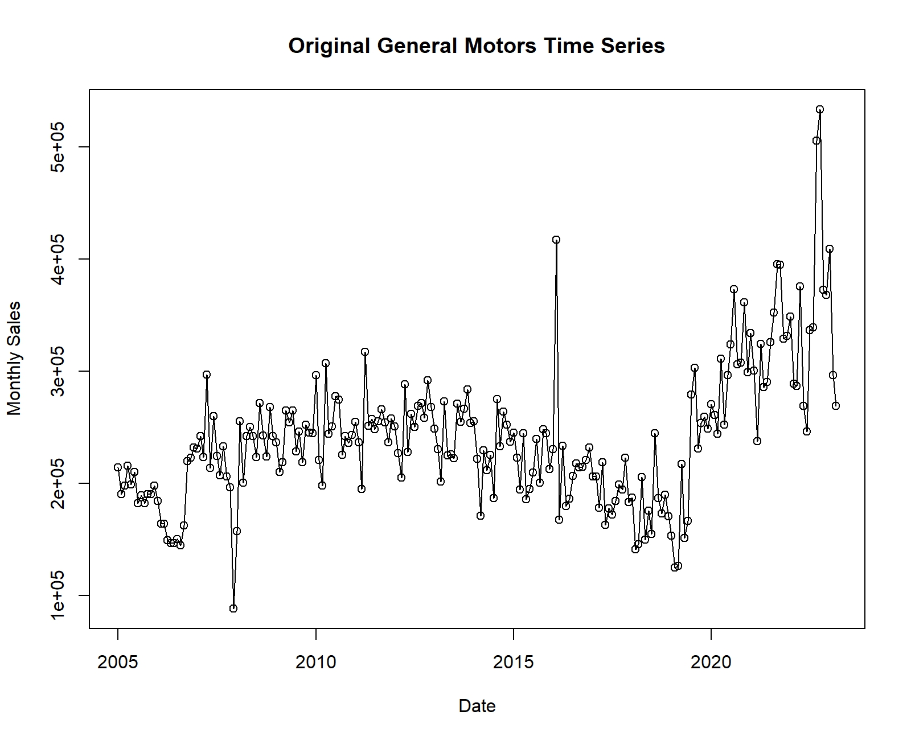

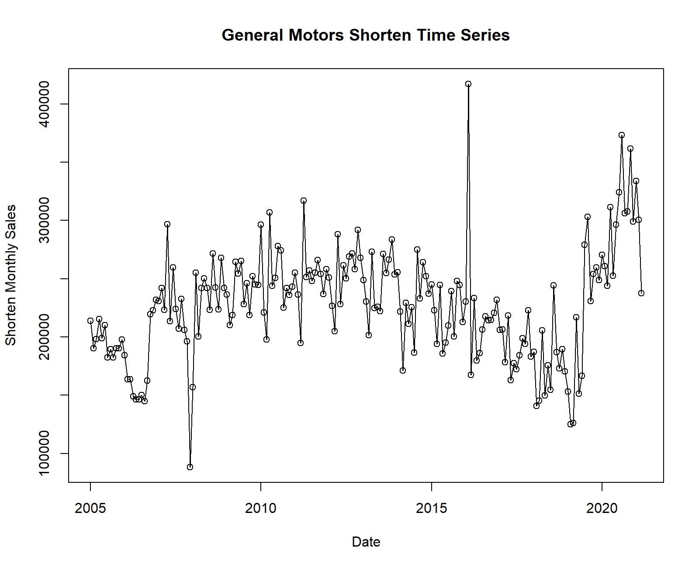

There is a change in trend and seasonality to be seen from the plot (fig. 2). As a result, the time series of sales does not appear to be stationary.  A stationary time series is one whose statistical properties, such as the mean and variance, do not change over time, while a non-stationary time series has statistical properties that are time-dependent and can vary over time.

Furthermore, we can proceed with the ADF test.

Clearly, from the ADF test result, the $p$-value for the time series is significantly greater than the significance level $\alpha = 0.05$, thus we fail to reject the null hypothesis. 

Plotting the ACF and PACF graphs can also help understanding the time series better. In time series analysis, ACF (Autocorrelation Function) and PACF (Partial Autocorrelation Function) plots are often used to determine the order of Autoregressive (AR) and Moving Average (MA) models.

The ACF plot displays the relationship between the values of a time series and its lagged values. The ACF plot can be used to identify the order of an MA model by observing the number of lags with significant autocorrelation.
 
The PACF plot displays the relationship between a time series and its lag values. The PACF plot can be used to identify the order of an AR model by observing the number of lags with significant partial autocorrelation.

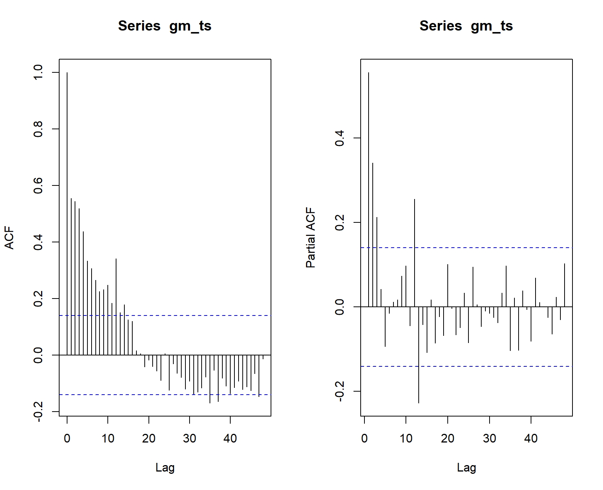

## Transforming the Data 

The next step is taking the logarithm of the time series. This is a common data transformation technique used in time series analysis. In our data set, we notice a variability in the data overtime, which makes it difficult to forecast the series accurately. Taking the logarithm of the series can help to stabilize the variance, by compressing the range of values for large observations and expanding the range for small observations.

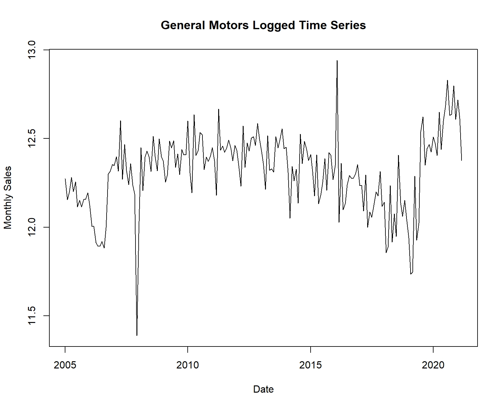

Transformations such as logarithms can help to stabilize the variance of a time series. But when it comes to the mean of time series, differencing can help stabilize the mean of a time series by removing changes in the level of a time series and therefore eliminating (or reducing) trend and seasonality.

The differenced series is the change between consecutive observations in the original series and can be written as

$$ X_t ' = X_{t+1} - X_t $$ 

where $X_t$ is a time series. 

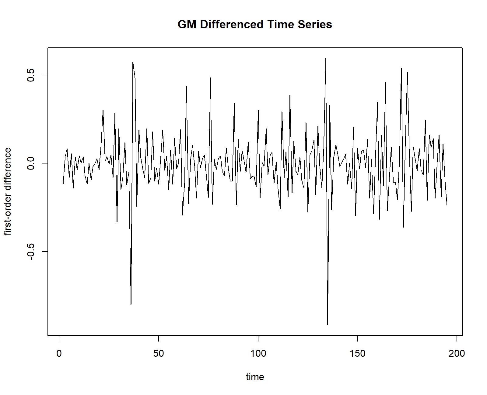

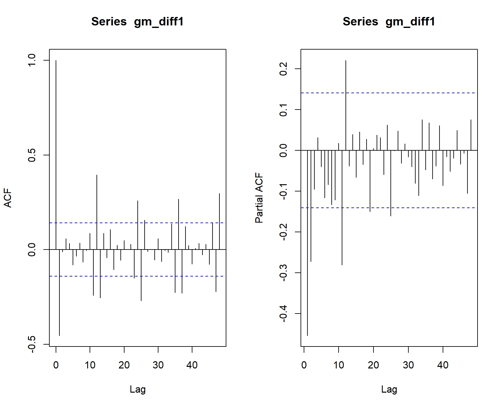

At times, the differenced data might not appear to be stationary, and it might be required to perform a second differencing to achieve a stationary series: 

$$ X_t '' = X_{t+1} ' - X_t '.$$ 

In our case, that step is not necessary. 

Furthermore, in the case of a stationary time series at $lag = h$, it might be required to perform another differencing at $lag = h$. Seasonal differencing is defined as a difference between a value and a value with lag that is a multiple of $S$.

Seasonality in time series refers to the pattern of regular and predictable fluctuations that occur over fixed intervals of time, such as days, weeks, months, or years.

In our case, the PACF shows a spike at lag 12, which may suggest seasonality and the ACF shows a strong correlation at lags 12,24,36 (fig.3 and fig.6).

If a time series is seasonal at lag = 12, it means that there is a repeating pattern or regular fluctuation in the data that occurs every 12 time units. In the context of monthly data, a seasonal pattern at lag = 12 indicates a yearly seasonality, where the same or similar pattern tends to repeat every 12 months. Therefore, a seasonal pattern at lag = 12 suggests that the time series exhibits a recurring behavior on an annual basis. Understanding seasonality at lag = 12 allows to account for these recurring patterns when developing forecasting models.

Let's look at a seasonal sales boxplot to understand better the seasonality.

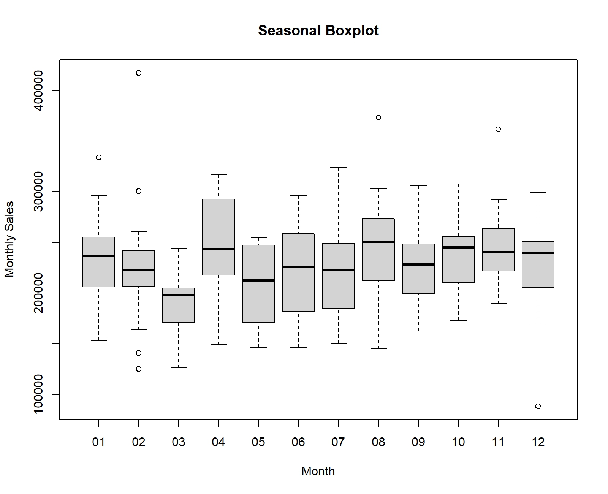

This graph shows a visual of any recurring seasonal patterns or fluctuations. For example, the sales seem to be low during March, but they increase in April, then slightly decrease until August,  when they increase back, and so on. 

If $S = 12$, which occurs with monthly data, a seasonal difference is $(1-B^{12}) X_t = X_t - X_{t-12}$. Seasonal differencing removes seasonal trends and can also get rid of a seasonal random walk type of non-stationarity. 

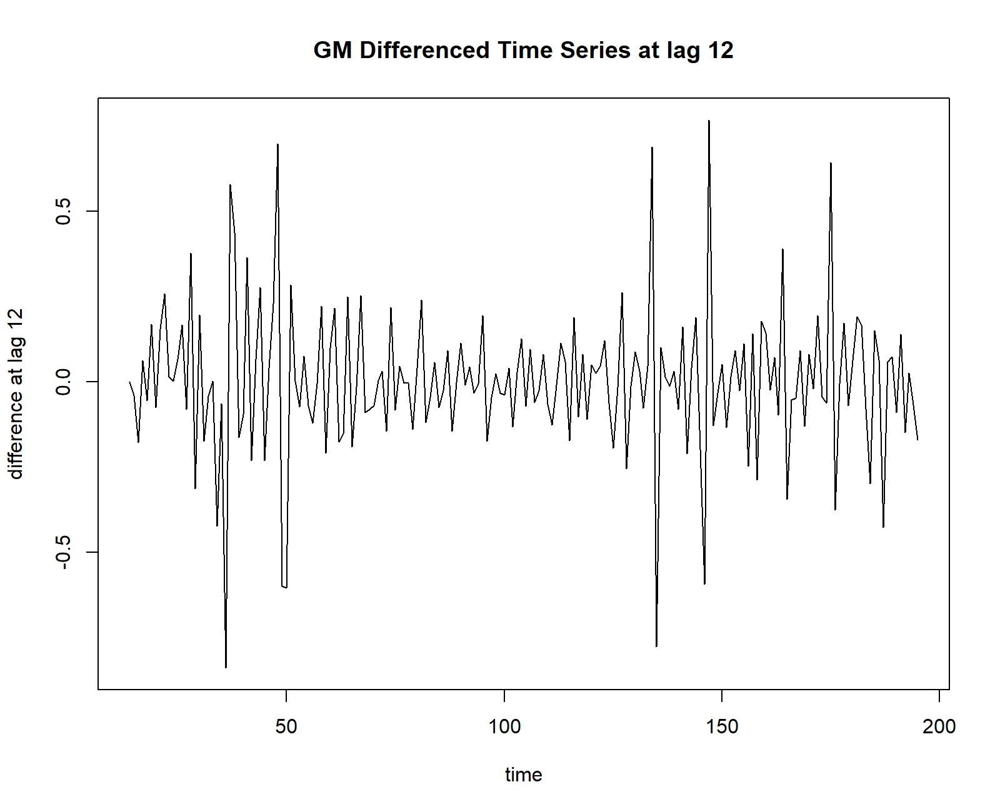

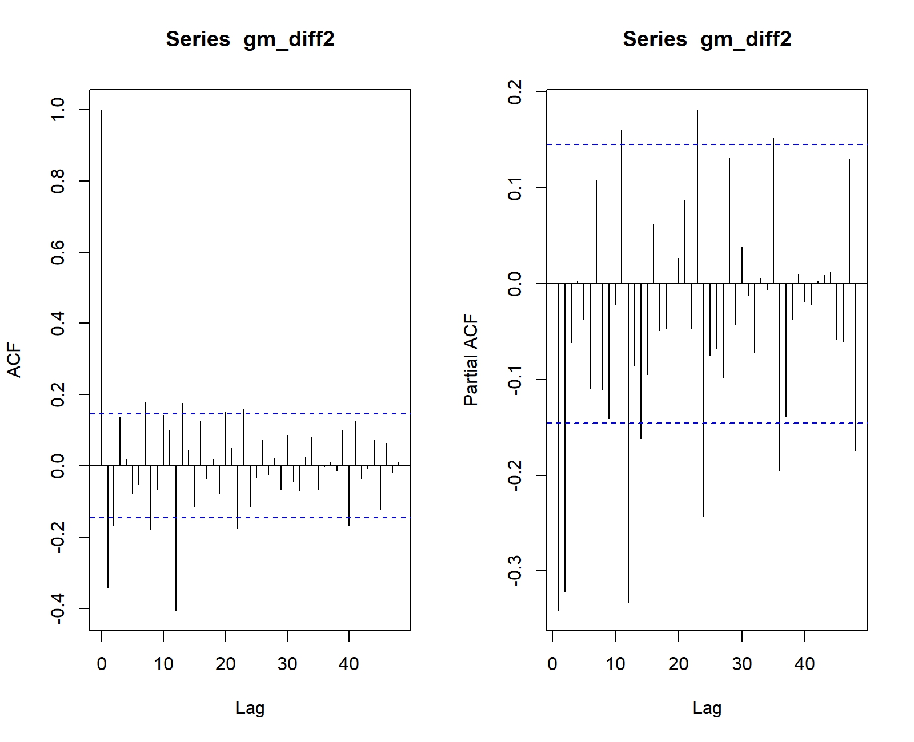

We run the ADF test again to make sure that now we have a stationary series. 

From the test, $p = 0.01 < 0.05$, thus we reject the null hypothesis, i.e. the time series is now stationary. 

# Model Specification

## Rationale for choosing the model

Clearly, the time series represents a SARIMA $(p,d,q)x(P,D,Q)$ model. A SARIMA model is an ARIMA model with a seasonal component, where 

- $p$ and seasonal $P$ indicate the autoregressive order. 

- $d$ and seasonal $D$ indicate differencing that must be done to stationarize series. 

- $q$ and $Q$ indicate the moving average order.

By definition, if $d$ and $D$ are non-negative integers, then $\{X_t\}$ is a seasonal ARIMA $( p, d, q) x (P, D, Q)s$ process with period $s$ if the differenced series $Y_t = (1-B)^d(1-B^s)^DX_t$ is a causal ARMA process defined by
$$\phi(B) \Phi(B^s) Y_t = \theta(B) \Theta (B^s) Z_t, {Zt} \sim WN (0, \sigma^2) $$
where the non-seasonal components are 

- AR: $\phi(z) = 1 - \phi_1 z - \ldots - \phi_pz^p$

- MA: $\theta(z) = 1 + \theta_1z+ \ldots +\theta_qz^q$ 

and the seasonal components are 

- seasonal AR: $\Phi(z) = 1 - \Phi_1 z - \ldots - \Phi_pz^p$

- seasonal MA: $\Theta(z) = 1 + \Theta_1z+ \ldots + \Theta_qz^q$.

For our both time series, $D = 1$ and $d = 1$. To determine $p$, $q$, $P$, and $Q$, we can refer to the ACF and PACF plots.

From the ACF and PACF plots, for the sales time series, we notice a significant spike on the ACF plot before the first seasonal $lag = 12$ and three noticeable lags on the PACF plot at lags $12, 24, 36$. This may suggest that $P = 3$ and $Q = 1$.

However, in this case, basing my analysis only on the ACF and PACF plots may result in uncertain and insufficient conclusions.

To determine the best $p$, $P$, $q$ and $Q$, we use the following code

```{r algorithm}

# Load the necessary packages
library(forecast)
library(ggplot2)

# Choosing the best model for GM Time Series

# Set values for d, D, and s
d <- 1
D <- 1
s <- 12

# Initialize variables to store minimum AIC and corresponding parameters
min_aic_gm <- Inf
best_params_gm <- c()

# Loop over values of p, q, P, and Q
for (p in 1:3) {
  for (q in 1:3) {
    for (P in 1:3) {
      for (Q in 1:3) {
        # Check if the sum of parameters is less than or equal to 10
        if (p + d + q + P + D + Q <= 10) {
          # Fit ARIMA model 
          model_gm <- try(arima(log(gm_ts), order=c(p-1, d, q-1), 
                             seasonal=list(order=c(P-1, D, Q-1),period=s)), silent = TRUE)
          # Check for errors in model fitting
          if (class(model_gm) == "try-error") {
            next
          }
          # Perform Ljung-Box test on residuals of fitted model
          test <- Box.test(model_gm$residuals, lag=log(length(model_gm$residuals)))
          # Calculate SSE of fitted model
          sse <- sum(model_gm$residuals^2)
          # Update minimum AIC and corresponding parameters if a better model is found
          if (model_gm$aic < min_aic_gm) {
            min_aic_gm <- model_gm$aic
            best_params_gm <- c(p-1, d, q-1, P-1, D, Q-1)
          }
          # Print AIC, SSE, and p-value of fitted model
          cat(p-1, d, q-1, P-1, D, Q-1, "AIC:", model_gm$aic, "SSE:", sse, 
              "p-value:", test$p.value, "\n")
        }
      }
    }
  }
}

# Print the best parameters and minimum AIC
cat("Best Parameters: p, d, q, P, D, Q =", best_params_gm, "\n")
cat("Minimum AIC =", min_aic_gm, "\n")

```

The output of the code includes the AIC, SSE, and the p-value of each fitted model. The AIC (Akaike Information Criterion) is calculated as $$AIC = 2k - 2ln(L),$$ where $k$ is the number of parameters in the model, and $L$ is the likelihood function of the model. The AIC is a measure of the quality of a statistical model, with lower values indicating better fit. The SSE is the sum of squared errors of the fitted model, which measures how well the model fits the data. 

The Ljung-Box test is a statistical test for autocorrelation in a time series. The test is used to assess whether the residuals (i.e., the differences between the observed values and the values predicted by a model) of a time series model are independently distributed. Therefore, the null hypothesis of the Ljung-Box test is that the residuals of the fitted model are independently distributed. 

Regarding the p-value of the Ljung-Box test, if the p-value of the Ljung-Box test is small ( less than 0.05), this provides evidence against the null hypothesis. Hence, a small p-value suggests that the model may not be a good fit for the data.

Conversely, if the p-value of the Ljung-Box test is large (greater than 0.05), this suggests that there is no evidence against the null hypothesis and that the residuals are independently distributed. In this case, the model is likely a good fit for the data.

From the results of the code above, we choose the best fitting model for the time series to be $(0,1,2)x(0,1,1)$ with the smallest $AIC = -148.6715$ and $p-value =  0.6984616$ from Ljung-Box test. 

# Model Fitting

## Parameter estimation

For a SARIMA$(0,1,2)x(0,1,1)_{12}$, the equation would be 
$$(1-B)^1(1+B^{12})^1X_t =  (1+ \theta_1B + \theta_2B^2)(1+ \Theta_1B^{12})Z_t$$
where $Z_t \sim (0, \sigma^2)$. 

Therefore, for the GM model, the equation would be

$$(1-B)^1(1+B^{12})^1X_t =  (1-1.5205B + 0.5205B^2)(1-1.0000B^{12})Z_t$$

where $$Z_t \sim (0,  0.04101)$$

# Model Diagnostics

## Residual Analysis

As mentioned above, residuals in time series are what is left over after fitting a model. For most of the time series models, residuals are equal to the difference between the observation and corresponding fitted values. To make sure that the models we have choosen are a good fit, we need to make sure that the residuals are white noise. 

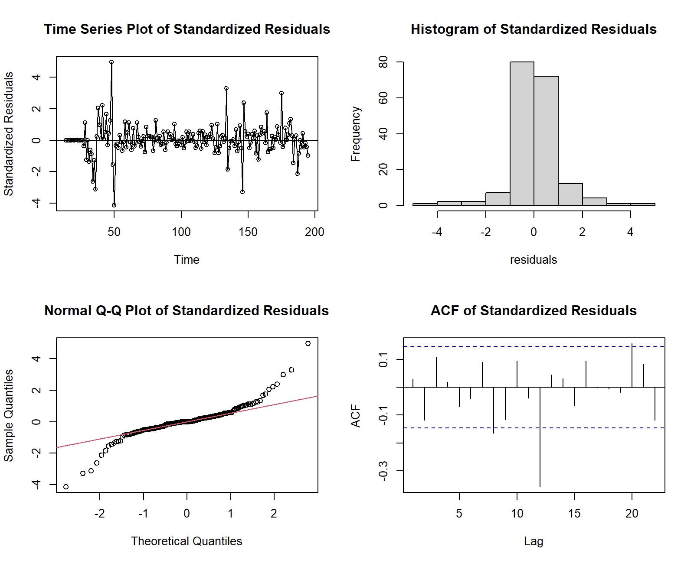

From the residual analysis, we conclude the following, for the chosen model:

- From the Time Series plot, the residuals show no trend, i.e. stationary.

- From the histogram, we notice a normal distribution of the residuals.

- The QQplot also displays normality.

- And, the ACF plot represents white noise residuals.

Thus, we can say that the model we chose, fits the best. 

# Forecasting 

The last step would be forecasting the monthly sales for the General Motors Company for the next $24$ months. 

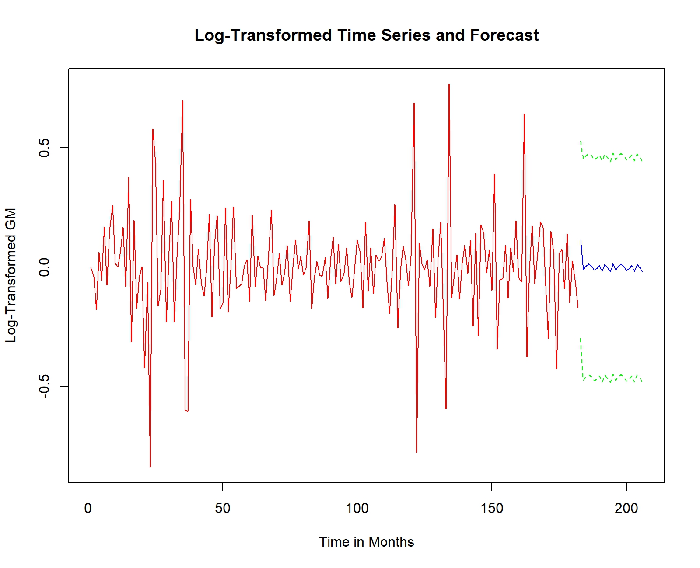

\newpage

# Conclusions 

Market Analysis: The time series analysis provides valuable insights into the monthly sales performance of General Motors Company in the US automotive market over the past two decades. 

At first, a consistently steady trend is evident in the sales data. Notably, there is a spike around the year 2016, attributed to several factors including the favorable conditions of the overall automotive market in the United States and the ongoing economic recovery post the global financial crisis of 2008. Subsequently, a notable decline is observed during the 2019-2020 timeframe, attributed to the impact of the COVID-19 pandemic. Following this downturn, there is a subsequent increase in sales, characterized by a more sustained pattern.

On the model selection, the SARIMA(0,1,2)(0,1,1) model was identified as the best-fit model for the time series. The model selection process involved considering various combinations of parameters, and the chosen model demonstrated the lowest AIC, indicating a good balance between model complexity and goodness of fit.

The original time series exhibited non-stationarity, but after applying first-order differencing and seasonal differencing at lag 12, a stationary series was achieved. This transformation is essential for building accurate forecasting models.

The diagnostic analysis of the selected model's residuals indicates that the residuals exhibit characteristics of white noise, suggesting that the model adequately captures the underlying patterns in the data.

The forecasting section provides a glimpse into the future by predicting General Motors' monthly sales for the next 24 months. The forecasted values, along with prediction intervals, offer a range of potential outcomes and highlight the uncertainty associated with future predictions. 

In contrast to the initial data available for this timeframe, variations are noticeable, but it appears that the prediction intervals encompass the original data. This implies that the prediction error is likely to fall within the specified interval.


# References

1. Brockwell, Peter J., Davis, Richard A. (2016). Introduction to Time Series and Forecasting, Third Edition

2. Cryer, J.D., Chan, K-S., (2008). Time Series Analysis with applications in R, Second Edition

3. Prabhakaran, S. (2021). ARIMA Model - Complete Guide to Time Series Forecasting in Python (https://www.machinelearningplus.com/time-series/arima-model-time-series-forecasting-python/)

4. Graves, A. (2020). Time Series Forecasting with a SARIMA Model
(https://towardsdatascience.com/time-series-forecasting-with-a-sarima-model-db051b7ae459)

